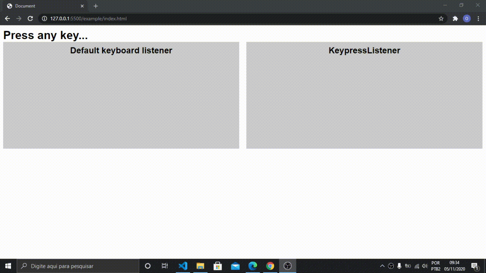
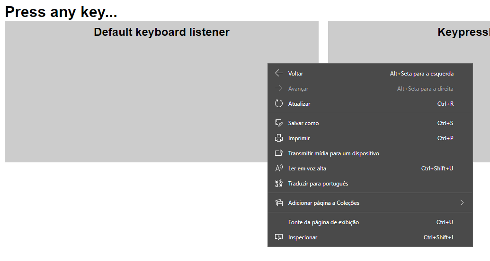

<h1 align="center">KeypressListener</h1>
<p align="center">lib to web projects that require a precise keyboard listener</p>



# Table of contents
<!--ts-->
  * [Installation](#installation)
  * [Getting started](#getting-started)
  * [Guide](#guide)
    * [Create your own verification loop](#Create-your-own-verification-loop)
  * [How KeypressListener deals with contextMenu](#How-KeypressListener-deals-with-contextMenu)
  * [License](#license)
  * [Author](#author)
<!--te-->

# Installation

Click [here](https://raw.githubusercontent.com/DanielGustavo/KeypressListener/main/lib/KeypressListener.js) to access the file, and press **ctrl + s** to save it in your project's folder. Now, import it in an HTML file:

```
<script src="./KeypressListener.js"></script>
```

# Getting started
KeypressListener is pretty simple to use, take a look:

```
const keypressListener = new KeypressListener();
keypressListener.startListening();
```

The `startListening()` method starts a loop, which notifies what keys are pressed 60 times per second.

```
const keypressListener = new KeypressListener();
keypressListener.startListening();

keypressListener.onKeyUp((event) => {
  console.log(event);
});

keypressListener.onKeyPress((event) => {
  console.log(event);
});
```

The `event` argument in `keypressListener.onKeyPress()` and `keypressListener.onKeyUp()` is the same of `document.onkeydown` and `document.onkeyup`.

# Guide

## Create your own verification loop
A KeypressListener instance has a method called `tick()`, which executes the function passed in `onKeyPress()` and passes the event of each pressed keys.

So, if you want to use the KeypressListener in an existing loop *(in a gameloop for example)*, instead of `startListening()` use `tick()` inside a loop;

```
const keypressListener = new KeypressListener();

keypressListener.onKeyPress((event) => {
  console.log(event.key);
});

setInterval(keypressListener.tick, 1000 / 5);
```

# How KeypressListener deals with contextMenu
First things first, what's contextMenu? So, the contextMenu is displayed when the user clicks the right mouse button:



When the user is pressing any key and opens the contextMenu, the method in `document.onkeyup` isn't executed, so the KeypressListener would understand that the key is being pressed while it's not.

However, the KeypressListener stops pressing all the keys when the contextMenu is fired, and when the contextMenu is out, the KeypressListener executes the method passed in `onKeyUp()`, passing an object **`{type: "contextMenuOut"}`** as argument.

# License
[MIT](./LICENSE)

# Author

<a href="https://github.com/DanielGustavo">
  
</a>

<p>Made by <a href="https://github.com/DanielGustavo"><b>Daniel Gustavo</b></a></p>

[](mailto:danielgustavo5205@gmail.com)
